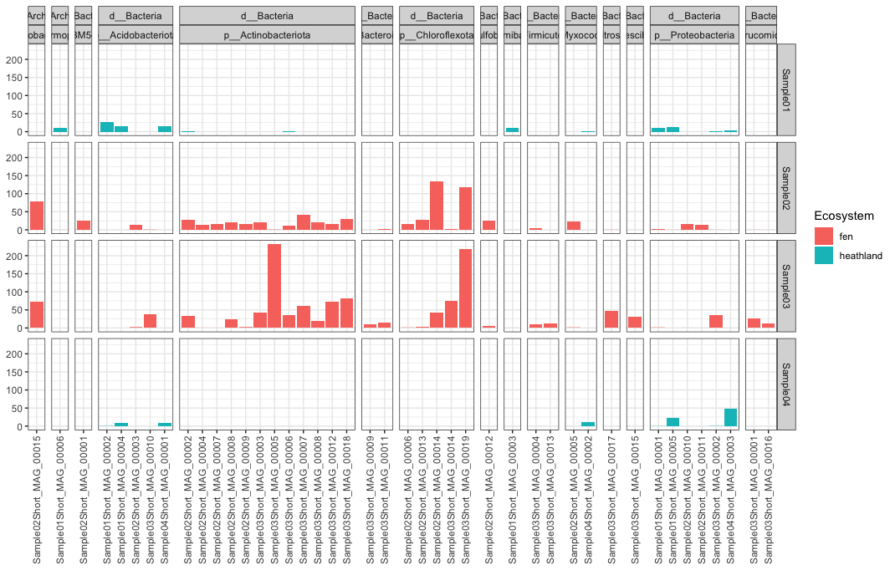

# Day 5

| Time      | Activity                                        | Slides                                                  | Hands-on                                                    |
|-----------|-------------------------------------------------|---------------------------------------------------------|-------------------------------------------------------------|
| Morning   | MAG annotation and downstream analyses (Part 1) | [Link here](MAG-annotation-and-downstream-analyses.pdf) | [Link here](#MAG-annotation-and-downstream-analyses-part-1) |
| Afternoon | MAG annotation and downstream analyses (Part 2) |                                                         | [Link here](#MAG-annotation-and-downstream-analyses-part-2) |
| Afternoon | Closing remarks and open discussion             |                                                         |                                                             |

## MAG annotation and downstream analyses (Part 1)
First login to Puhti and go to your working directory:

```bash
cd /scratch/project_2001499/$USER
```

Although you have probably binned some nice MAGs, we will work from now on with MAGs that Antti and Igor have binned.
Let's copy the FASTA files to your working directory:

```bash
cp -r ../COURSE_FILES/MAGs MAGs
```

Let's also take the summary file for each of the four samples:

```bash
for SAMPLE in Sample01 Sample02 Sample03 Sample04; do
  cp BINNING_MEGAHIT/$SAMPLE/MAGsSummary/bins_summary.txt MAGs/$SAMPLE.bins_summary.txt
done
```

And finally, let's also take a couple of files summarizing the abundance of the MAGs across the different samples:

```bash
for SAMPLE in Sample01 Sample02 Sample03 Sample04; do
  cp BINNING_MEGAHIT/$SAMPLE/MAGsSummary/bins_across_samples/mean_coverage.txt MAGs/$SAMPLE.mean_coverage.txt
  cp BINNING_MEGAHIT/$SAMPLE/MAGsSummary/bins_across_samples/detection.txt MAGs/$SAMPLE.detection.txt
done
```

### Taxonomic assignment with GTDBtk
Normally, one thing that we want to learn more about is the taxonomy of our MAGs.  
Although `anvi'o` gives us a preliminary idea, we can use a more dedicated platform for taxonomic assignment of MAGs.  
Here we will use `GTDBtk`, a tool to infer taxonomy for MAGs based on the GTDB database (you can - and probably should - read more about GTDB [here](https://gtdb.ecogenomic.org/)).  

We have prepared a script to run `GTDBtk` for you, so let's copy it and take a look:

```bash
cp ../COURSE_FILES/SBATCH_SCRIPTS/GTDBtk.sh .
```

And submit the script using `sbatch`.

### MAG dereplication with dRep
Because we are doing individual assemblies, it could be that we have obtained a given MAG more than once.  
To remove this redundancy, we perform a step that is called dereplication.  
Here we will use `dRep` for this (to learn more about `dRep` see [here](https://drep.readthedocs.io/)):

```bash
sinteractive -A project_2001499 -c 4

export PROJAPPL=/projappl/project_2001499
module load bioconda/3
source activate drep

dRep compare DREP \
             --genomes MAGs/*.fa \
             --processors 4
```

Copy the `DREP` folder to your computer and look at the PDF files inside the `figures` folder, particularly the primary and secondary clustering dendrograms.  
Also look at the `Cdb.csv` file inside `data_tables`.  
How many clusters of duplicated (redudant) MAGs do we have?

### Functional annotation
Let's now annotate the MAGs against databases of functional genes to try to get an idea of their metabolic potential.  
As everything else, there are many ways we can annotate our MAGs.  
Here, let's take advantage of `anvi'o` for this as well.  
Annotation usually takes some time to run, so we won't do it here.  
But let's take a look below at how you could achieve this:

```bash
anvi-run-ncbi-cogs --contigs-db CONTIGS.db \
                   --num-threads 4

anvi-run-kegg-kofams --contigs-db CONTIGS.db \
                     --num-threads 4

anvi-run-pfams --contigs-db CONTIGS.db \
               --num-threads 4
```

These steps have been done by us already, and the annotations have been stored inside the `CONTIGS.db` of each assembly in `/scratch/project_2001499/COURSE_FILES/BINNING_MEGAHIT`.  
What we need now is to get our hands on a nice table that we can then later import to R.  
We can achieve this by running `anvi-export-functions`.
If you're not yet in the `sinteractive` session, connect to it, go to your working directory, load `bioconda`, activate the `anvio-7` environment, and then:

```bash
for SAMPLE in Sample01 Sample02 Sample03 Sample04; do
  anvi-export-functions --contigs-db BINNING_MEGAHIT/$SAMPLE/CONTIGS.db \
                        --output-file MAGs/$SAMPLE.gene_annotation.txt
done
```

Since we're at it, let's also recover the information about i) the genes found in each split and ii) which splits belong to wihch bin/MAG.  
I don't think there's a straightforward way to get this using `anvi'o` commands, but because `CONTIGS.db` and `PROFILES.db` are [SQL](https://en.wikipedia.org/wiki/SQL) databases, we can access information within them using `sqlite3`:

```bash
for SAMPLE in Sample01 Sample02 Sample03 Sample04; do
  # Get list of gene calls per split
  printf '%s|%s|%s|%s|%s\n' splits gene_callers_id start stop percentage > MAGs/$SAMPLE.genes_per_split.txt
  sqlite3 BINNING_MEGAHIT/$SAMPLE/CONTIGS.db 'SELECT * FROM genes_in_splits' >> MAGs/$SAMPLE.genes_per_split.txt


  # Get splits per bin
  printf '%s|%s|%s\n' collection splits bins > MAGs/$SAMPLE.splits_per_bin.txt
  sqlite3 BINNING_MEGAHIT/$SAMPLE/MERGED_PROFILES/PROFILE.db 'SELECT * FROM collections_of_splits' | grep 'MAGs|' >> MAGs/$SAMPLE.splits_per_bin.txt
done
```

## MAG annotation and downstream analyses (Part 2)
Now let's get all these data into R to explore the MAGs taxonomic identity and functional potential.  
First, download all **TXT** files **(NOT FASTA)** inside the `MAGs` folder to your computer.  
Also grab the `gtdbtk.bac120.summary.tsv` and `gtdbtk.ar122.summary.tsv` files that are inside the `GTDB` folder.  

Now let's combine these data into some custom analyses we can do to explore our MAGs.  
We will do that in `R/RStudio`.
First, let's load the packages we will need and import the data:

```r
library(tidyverse)

# Create metadata
metadata <- tibble(Sample = c("Sample01", "Sample02", "Sample03", "Sample04"),
                   Ecosystem = c("heathland", "fen", "fen", "heathland"))

# Read bins summary
summary <- bind_rows(read_delim("Sample01.bins_summary.txt", delim = "\t"),
                     read_delim("Sample02.bins_summary.txt", delim = "\t"),
                     read_delim("Sample03.bins_summary.txt", delim = "\t"),
                     read_delim("Sample04.bins_summary.txt", delim = "\t"))

# Make a list of MAGs
MAGs <- summary %>%
  filter(str_detect(bins, "_MAG_")) %>%
  pull(bins)

# Read bins coverage
coverage <- bind_rows(read_delim("Sample01.mean_coverage.txt", delim = "\t"),
                      read_delim("Sample02.mean_coverage.txt", delim = "\t"),
                      read_delim("Sample03.mean_coverage.txt", delim = "\t"),
                      read_delim("Sample04.mean_coverage.txt", delim = "\t")) %>%
  rename_all(~str_replace(., "SAMPLE", "Sample"))

# Read bins detection
detection <- bind_rows(read_delim("Sample01.detection.txt", delim = "\t"),
                       read_delim("Sample02.detection.txt", delim = "\t"),
                       read_delim("Sample03.detection.txt", delim = "\t"),
                       read_delim("Sample04.detection.txt", delim = "\t")) %>%
  rename_all(~str_replace(., "SAMPLE", "Sample"))

# Read GTDB taxonomy
GTDB <- bind_rows(read_delim("gtdbtk.ar122.summary.tsv",  delim = "\t") %>% mutate(red_value = as.numeric(red_value)),
                  read_delim("gtdbtk.bac120.summary.tsv", delim = "\t") %>% mutate(red_value = as.numeric(red_value))) %>%
  separate(classification, into = c("Domain", "Phylum", "Class", "Order", "Family", "Genus", "Species"), sep = ";") %>%
  rename(bins = user_genome) %>%
  mutate(bins = str_remove(bins, "-contigs"))

# Read annotation
annotation <- bind_rows(read_delim("Sample01.gene_annotation.txt", delim = "\t") %>% mutate(Sample = "Sample01"),
                        read_delim("Sample02.gene_annotation.txt", delim = "\t") %>% mutate(Sample = "Sample02"),
                        read_delim("Sample03.gene_annotation.txt", delim = "\t") %>% mutate(Sample = "Sample03"),
                        read_delim("Sample04.gene_annotation.txt", delim = "\t") %>% mutate(Sample = "Sample04")) %>%
  rename(gene_function = `function`)

# Read list of gene calls per split
gene_calls <- bind_rows(read_delim("Sample01.genes_per_split.txt", delim = "|") %>% mutate(Sample = "Sample01"),
                        read_delim("Sample02.genes_per_split.txt", delim = "|") %>% mutate(Sample = "Sample02"),
                        read_delim("Sample03.genes_per_split.txt", delim = "|") %>% mutate(Sample = "Sample03"),
                        read_delim("Sample04.genes_per_split.txt", delim = "|") %>% mutate(Sample = "Sample04"))

# Read list of splits per bin
splits <- bind_rows(read_delim("Sample01.splits_per_bin.txt", delim = "|") %>% mutate(Sample = "Sample01"),
                    read_delim("Sample02.splits_per_bin.txt", delim = "|") %>% mutate(Sample = "Sample02"),
                    read_delim("Sample03.splits_per_bin.txt", delim = "|") %>% mutate(Sample = "Sample03"),
                    read_delim("Sample04.splits_per_bin.txt", delim = "|") %>% mutate(Sample = "Sample04"))
```

### Exercise 1
Now that all data is loaded into `R`, let's do some exploring.  
By looking at the `summary` object, can you answer:

- How many bins **AND** MAGs we have in total, and how many for each sample?
- What is the mean completion, detection and length of the **MAGs**?
- Can you make a nice bar/box/violin plot summarising these values?

**SOLUTION BELOW (COMING UP SOON)**

```r

```

### Exercise 2
Now let's focus on the GTDB taxonomy, which is stored in the `GTDB` object:  

- What are the **three** phyla with highest number of MAGs?
- And what about genera?
- Again, can you make a nice plot for this?

**SOLUTION BELOW (COMING UP SOON)**

```r

```

### Exercise 3
Now we might be interested in the distribution/abundance of our MAGs across the different samples (object `coverage`).  

- What is the bin/MAG with the highest coverage when averaged across all samples? To which taxon it belongs?
- Now, can you make a plot that shows the coverage of the MAGs across each of the four samples, with phylum-level taxonomic information as well? I'm thinking something like this (but potentially better-looking):



- Detection is also an important metric, can you replicate the plot before but using the `detection` object instead?
- Do these abundance patterns agree with what we have seen using the read-based approach?

**SOLUTION BELOW (COMING UP SOON)**

```r

```

### Exercise 4
Finally, let's look at the annotation of genes in each bin/MAG.  
We might be interested in knowing, for example, which bin(s)/MAG(s) encode the nitric oxide reductase enzyme (NorBC), which is the enzyme responsible for converting nitric oxide (NO) to nitrous oxide (N2O), a potent greenhouse gas:

```r
# We can first find the bins/MAGs containing the enzyme
NOR <- annotation %>%
  filter(str_detect(accession, "K04561") | str_detect(accession, "K02305")) %>%
  left_join(gene_calls) %>%
  left_join(splits)

# And then see to which taxa they belong
NOR %>%
  select(bins) %>%
  mutate(MAG_or_BIN = ifelse(str_detect(bins, "Bin"), "bin", "MAG")) %>%
  left_join(GTDB) %>%
  group_by(MAG_or_BIN, Domain, Phylum) %>%
  tally
```

Now, can you modify the commands above to search for other enzymes, e.g.:

- Nitrous oxide reductase (NosZ), which consumes N2O releasing nitrogen
- Nitrogenase (NifH), which fixes atmospheric nitrogen into ammonia
- What about methane production (McrA; methyl-coenzyme M reductase) and oxidation (PmoA; methane monooxygenase)?

**Hint:** You can look for KEGG identifiers (K00000 type of ids) in their [website](https://www.genome.jp/kegg).  

**SOLUTION BELOW (COMING UP SOON)**

```r

```
